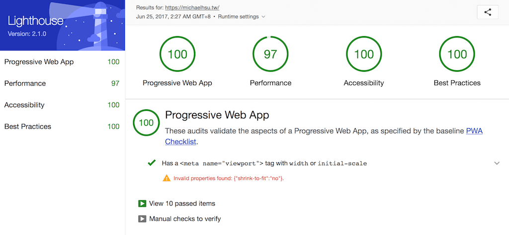

# michaelhsu.tw

[![Travis][build-badge]][build] [![Codecov Status][codecov-badge]][codecov] [![Github Tag][githubTag-badge]][githubTag] [![license][license-badge]][license]

[![Dependency Status][dependency-badge]][dependency] [![devDependency Status][devDependency-badge]][devDependency] [![peerDependency Status][peerDependency-badge]][peerDependency]

[](https://greenkeeper.io/) [](https://github.com/prettier/prettier)

## Requirements

-   node >= 8.1.4
-   npm >= 5.0.3
-   yarn >= 0.27.5

## Technology Stacks

-   [Create-React-App](https://github.com/facebookincubator/create-react-app): Create React apps with no build configuration.
-   [React-snapshot](https://www.npmjs.com/package/react-snapshot): A zero-configuration static pre-renderer for React apps
-   [Styled-components](https://github.com/styled-components/styled-components): Visual primitives for the component age 💅
-   [React-progressive-bg-image](https://github.com/evenchange4/react-progressive-bg-image): Medium style progressive background image for React.
-   Travis - CI
-   Netlify - CD
-   Codecov - Coverage report
-   GA - [autotrack](https://github.com/googleanalytics/autotrack)
-   React-media: A CSS media query component for React
-   [Jest-styled-components](https://github.com/styled-components/jest-styled-components): Jest snapshot utilities for Styled Components
-   Prettier, Eslint: Coding style

## Development

```console
$ yarn install
$ yarn run start
$ yarn run build
```

## Deploy to GitHub pages

> Any git tags.

1.  Update `CHANGELOG.md`
2.  Create a new git tag

```console
$ npm version patch
```

## Test

```
$ yarn run format
$ yarn run eslint
$ yarn run test:watch
```

## PWA

- 2017.06.22



---

## Inspiration

- https://github.com/staltz/staltz.com

## CONTRIBUTING

*   ⇄ Pull requests and ★ Stars are always welcome.
*   For bugs and feature requests, please create an issue.
*   Pull requests must be accompanied by passing automated tests (`$ yarn run test`).

## [CHANGELOG](CHANGELOG.md)

## [LICENSE](LICENSE)

MIT: [http://michaelhsu.mit-license.org](http://michaelhsu.mit-license.org)

[build-badge]: https://img.shields.io/travis/evenchange4/michaelhsu.tw/master.svg?style=flat-square
[build]: https://travis-ci.org/evenchange4/michaelhsu.tw
[codecov-badge]: https://img.shields.io/codecov/c/github/evenchange4/michaelhsu.tw.svg?style=flat-square
[codecov]: https://codecov.io/github/evenchange4/michaelhsu.tw?branch=master
[dependency-badge]: https://david-dm.org/evenchange4/michaelhsu.tw.svg?style=flat-square
[dependency]: https://david-dm.org/evenchange4/michaelhsu.tw
[devDependency-badge]: https://david-dm.org/evenchange4/michaelhsu.tw/dev-status.svg?style=flat-square
[devDependency]: https://david-dm.org/evenchange4/michaelhsu.tw#info=devDependencies
[peerDependency-badge]: https://david-dm.org/evenchange4/michaelhsu.tw/peer-status.svg?style=flat-square
[peerDependency]: https://david-dm.org/evenchange4/michaelhsu.tw#info=peerDependencies
[githubTag-badge]: https://img.shields.io/github/tag/evenchange4/michaelhsu.tw.svg?style=flat-square
[githubTag]: ./CHANGELOG.md
[license-badge]: https://img.shields.io/github/license/evenchange4/michaelhsu.tw.svg?style=flat-square
[license]: http://michaelhsu.mit-license.org/
